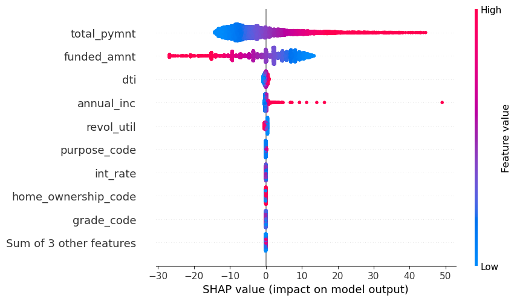

lending-club-loan-portfolio
==============================

- [Project Goal](#Project-Motivation)
- [Project Workflow](#Workflow)
- [Data Query](#Query)
- [Exploratory Data Analysis (EDA)](#EDA)
- [Model Building](#Model)
- [Feature Importance](#SHAP)
- [Loan Portfolio](#Portfolio)

## Project Goal 
**The goal** of this project is to identify the loans that are likely to be fully paid off by the borrowers, and default loans (loans that are considered to be risky and borrowers won't be able to be paid off). Identification of such applicants in this project by using Exploratory Data Analysis (EDA) and building a binary classifier.

**Background:** LendingClub is an American peer-to-peer lending company, headquartered in San Francisco, California. It is the world's largest peer-to-peer lending platform.

LendingClub enables borrowers to create unsecured personal loans between $1,000 and $40,000. Investors can search and browse the loan listings on the LendingClub website and select loans that they want to invest in based on the information supplied about the borrower, amount of loan, loan grade, and loan purpose, with a minimum investment of $25 per note. Investors make money from interest. LendingClub makes money by charging borrowers an origination fee and investors a service fee.

 

## Project Workflow 
 
Figure 1. Workflow to build a classification model and build the LendingClub loan portfolio.

## Data Query 
SQL is used to query data tables ready for EDA.

 
Figure 2. SQL queries create tables ready for visualization.

## Exploratory Data Analysis (EDA) 
I'm exploring the distribution of all the loans regarding the borrowers' features, and how interest rate over the year across 6 states influences the loan status. 

### Interest rate and Loan issued over the year
 
Figure 3. Amount of loans issued over the years and the interest rate trends across 6 states from 2007 - 2011

**Findings**
- The amount of issued loans seems to have grown exponentially over the range of 2007 - 2011.
    - Loans in 2008 were 8x more than in 2007
    - Amount of loans increases 2x/year from 2009 to 2011
- The 60-month loan term was introduced in 2010
- The interest rate follows the same trend across the 6 states:
    - The interest rate increased from 2007 and reached its peak in 2009
    - Declined in 2010, and slightly increased in 2011
- Some of the steepest increases took place in 2008 and 2009:
    - TX: 2.8% in 2008 and 1.8% in 2009
    - IL increased 2.6% in 2008
    - CA: 1.7% in 2008
      
### Loan Distribution
 
Figure 4. Loan distribution over some features (loan term, loan grade, states, loan purposes, home ownership status, loan status)

**Findings**
- The current default rate is 14.9%:
    - Fully paid: 85.1%
    - Charged off: 14.9%
- Loans significantly come from:
    - State: CA, NY
    - For debt_consolidation purpose
    - From renters and mortgage pay
- There are 7 grades loan A - G = high - low
    - The top 3 loan grades are A, B, and C (total 75.48%) with grade B having the highest amount (24.49%)

Term:
- There are two different loan terms, 36 months and 60 months.
- The number of 36-month loans is about ~ 3x more than 60-month loans in the dataset.
  
State:
- Most loans are generated from CA (35.69% or ~6k), which is nearly double from NY
- Loans from CA and NY made up half of the total loans from all 6 states
  
### Interest Rate Distribution
 
Figure 5. Interest rate distribution regarding categorical features

**Findings**
- The 36-month term has a lower average interest rate than the 60-month term.
- Paid-off loans have lower interest rates.
- The average interest rate is linearly correlated with the loan Grade, descendingly:
    - as the loan grade goes lower (A -> G), the interest rate increased
- Grade B loan has an average interest rate of 11.03, which is close to the overall interest rate mean of 12.09
- The interest rate is not influenced by state, purpose, or home ownership status

### Loan Status
 
Figure 6. Payoff rate and default rate for each loan term (3-year, 5-year) and loan grades (A-G)

**Findings**

Term:
- The overall payoff rate is 85.2%, of which 77% is from a 3-year term
- The payoff rate of the 3-year term is higher than the 5-year term

Grade:
- Recall: interest rate increase across A - G
- Payoff rate decreases across loan grades A - G
- Higher grades (A-C) have lower interest rates and higher payoff rate

## Model Building 
The dataset is highly imbalanced, with 85% class 1 (fully paid) and 15% class 0 (charged off), we can achieve better class 1 precision by setting **balanced class_weight**. In this project, the accuracy rate is not what we are looking for. The purpose of the classification model is to help us select loans that are more likely to be repaid. So our focus is on **the precision rate of class 1 and the recall rate of class 0**. 

I compared the performance of 2 classification models: logistic regression and random forest in their default and balanced class_weight states. I ran the 10-fold cross-validation on the train test and then compared the models' performance scores on the test set. 

The accuracy score of the zero model is 85%. Although all models exhibit high scores in precision and recall, the **Logistic Regression classifier with balanced class_weight** scored highest at the two important metrics of precision and recall:
- The precision rate of class 1 is 0.98: among all the loans identified as to be fully paid by the classification model, 98% of them are actually fully paid. This is much better than the repaid rate of the whole test set, which is about 85%.
- The recall rate of class 0 is 0.87: for all loans that are charged off, the model identifies 87% of them as charged off.

 
Figure 7. Compare the performance of the 2 classification models on the test set.

 
Figure 8. ROC and AUC of the 2 classification models in default and balanced class_weight settings

## Feature Importance 
The most important features that contribute most to determining the likelihood of a loan being paid off are:
- total payment: Payments received to date for the total amount funded
- funded amount: The total amount committed to that loan at that point in time
- dti: A ratio calculated using the borrower’s total monthly debt payments on the total debt obligations
- annual_inc: Borrower's annual income
- revol_util: Revolving line utilization rate
  
 
Figure 9. Summary of all the features' effects influencing the payoff ability. 

Loans that are more likely to be fully payoff when borrowers have:
- a high amount of total payment up-to-date
- small asked loan amount
- high annual income
  
 
Figure 10. Partial dependence plot showing the effects of the top 2 features on the loan payoff likelihood.

## Loan Portfolio 
The loan portfolio was conducted by applying some filters:
- class 1 loans: loans that are predicted to be fully paid
- loans without a public bankruptcy record

By applying the filter of choosing loans with no record of bankruptcy, the annual return for LendingClub increased by roughly 0.1% for both loan terms. By selecting the right feature, the Logistic model predicts loans with a high likelihood of being fully paid and double the annual return rate for LendingClub. 

| Model  | 3-year | 5-year |
| -------- | --- | --- |
| Current  | 2.69% | 2.74% |
| Rule-based method: No bankruptcy record | 2.90% | 2.90%|
| Proposed method: ML model + no bankruptcy record | 5.09% | 5.91%|
